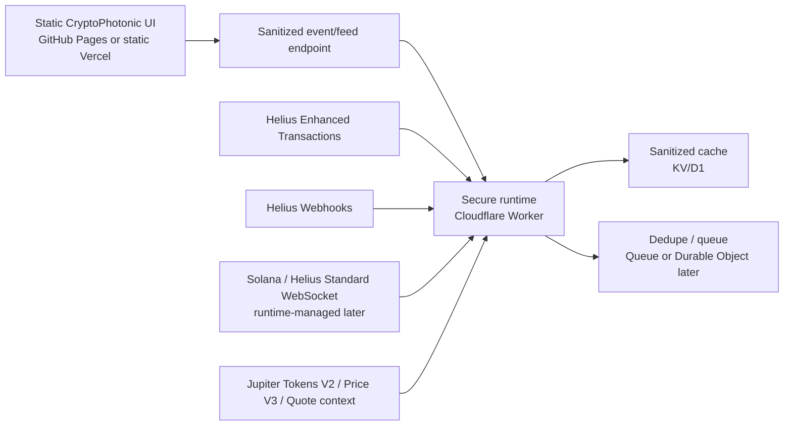

# CryptoPhotonic Realtime Data Architecture

Research date: 2026-05-06

This document plans the next realtime Solana architecture for CryptoPhotonic. It is intentionally research and architecture only: no API keys, live calls, backend implementation, browser-side live fetching, transaction signing, swap execution, or StockPhotonic data changes are introduced here.

## Executive Summary

CryptoPhotonic should remain a static, fixture-safe browser UI, but realtime Solana tracking cannot be implemented safely with GitHub Pages alone. GitHub Pages is static hosting; it can serve HTML, CSS, JavaScript, and JSON, but it cannot protect provider secrets, receive Helius webhooks, keep server-side WebSocket subscriptions alive, run dedupe state, enforce rate limits, or sanitize provider payloads before browser consumption.

Recommended path:

1. Keep the public UI static on GitHub Pages or migrate it to static Vercel only if deploy previews are useful.
2. Add a separate secure runtime first, preferably Cloudflare Workers with KV/D1 and optional Queues/Durable Objects for later realtime fanout.
3. Use Helius as the primary Solana transaction source:
   - Enhanced Transactions for bounded historical/backfill fetches.
   - Enhanced or raw Helius Webhooks for hosted realtime wallet/account event intake.
   - Standard Helius/Solana WebSockets only for targeted runtime-managed subscriptions.
   - Enhanced WebSockets only after paid-plan verification, because current Helius docs list Enhanced WebSockets as Business/Professional only.
4. Use Jupiter only for token metadata, discovery, pricing, and route interpretation. Do not add swap execution, transaction building, signing, or wallet authority.
5. Browser code should consume only sanitized graph-ready JSON or sanitized event batches produced by the secure runtime.

Selected architecture for the next implementation phase: Cloudflare Worker webhook/API runtime + Helius Enhanced Transactions/Webhooks + static CryptoPhotonic frontend. This is the best free/low-cost fit because it can hold secrets, expose public HTTPS endpoints for Helius, cache sanitized state, and stay decoupled from the existing static UI.

## Source Notes

Current official documentation was used wherever possible:

- Helius Enhanced Transactions, Webhooks, WebSockets, pricing, and FAQs:
  - https://www.helius.dev/docs/enhanced-transactions/parse-transactions
  - https://www.helius.dev/docs/api-reference/enhanced-transactions/gettransactions
  - https://www.helius.dev/docs/enhanced-transactions/transaction-history
  - https://www.helius.dev/docs/webhooks
  - https://www.helius.dev/docs/webhooks/faqs
  - https://www.helius.dev/docs/api-reference/webhooks
  - https://www.helius.dev/docs/rpc/websocket
  - https://www.helius.dev/docs/enhanced-websockets/transaction-subscribe
  - https://www.helius.dev/docs/billing/plans-and-rate-limits
- Solana RPC and WebSocket documentation:
  - https://solana.com/docs/rpc
  - https://solana.com/docs/core/clusters
  - https://solana.com/docs/rpc/websocket
  - https://solana.com/docs/rpc/websocket/accountsubscribe
  - https://solana.com/docs/rpc/websocket/logssubscribe
  - https://solana.com/docs/rpc/websocket/programsubscribe
  - https://solana.com/docs/rpc/websocket/signaturesubscribe
  - https://solana.com/docs/rpc/websocket/blocksubscribe
- Jupiter API documentation:
  - https://dev.jup.ag/docs/api-setup
  - https://dev.jup.ag/docs/api-rate-limit
  - https://dev.jup.ag/docs/tokens/v2
  - https://dev.jup.ag/api-reference/tokens/v2
  - https://dev.jup.ag/docs/price/v3
  - https://dev.jup.ag/docs/api/swap-api/quote
- Other data-source documentation:
  - https://docs.birdeye.so/docs/pricing
  - https://docs.birdeye.so/docs/rate-limiting
  - https://docs.birdeye.so/docs/websocket
  - https://docs.dexscreener.com/api/reference
  - https://docs.solscan.io/api-access
- Hosting/runtime documentation:
  - https://docs.github.com/pages/getting-started-with-github-pages/what-is-github-pages
  - https://vercel.com/docs/functions/limitations
  - https://vercel.com/docs/cron-jobs/usage-and-pricing
  - https://docs.netlify.com/build/functions/overview
  - https://docs.netlify.com/build/functions/background-functions
  - https://docs.netlify.com/functions/environment-variables
  - https://developers.cloudflare.com/workers/platform/limits
  - https://developers.cloudflare.com/workers/configuration/secrets
  - https://developers.cloudflare.com/workers/runtime-apis/websockets
  - https://developers.cloudflare.com/durable-objects
  - https://developers.cloudflare.com/kv/platform/limits
  - https://fly.io/docs/apps/secrets
  - https://fly.io/docs/about/pricing
  - https://render.com/docs/free
  - https://render.com/docs/websocket
  - https://render.com/docs/disks
  - https://supabase.com/docs/guides/functions/limits

Provider pricing, quotas, endpoint availability, and beta status can change. Anything marked "verify before implementation" must be checked again immediately before code is written.

## Why GitHub Pages Alone Is Insufficient

GitHub Pages is appropriate for the existing static UI and generated fixture browsing. It is not enough for realtime provider integration.

| Need | GitHub Pages Fit | Reason |
|---|---:|---|
| Serve static CryptoPhotonic UI | Good | GitHub Pages is static hosting for repository files. |
| Keep Helius/Jupiter/private RPC secrets | No | Any value shipped to browser JavaScript is public. |
| Receive Helius webhooks | No | Helius needs a public HTTPS receiver that can execute server code and return status. |
| Maintain provider WebSocket subscriptions | No | Browser WebSockets would expose provider URLs/keys and cannot perform trusted filtering. |
| Dedupe realtime events | No | Requires trusted state outside browser memory. |
| Cache sanitized event batches | Limited | Static JSON can be committed, but not safely written at request time. |
| Enforce per-wallet allowlists and request budgets | No | Browser code can be bypassed. |
| Produce reviewed graph-ready data | Partial | Existing fixtures work, but realtime intake needs a trusted sanitizer. |

GitHub Pages should therefore remain a viewer and demo host, not the live-data authority.

## Helius Research

### Helius Capabilities

| Capability | Current Docs Summary | Best Use In CryptoPhotonic | Limitations / Verify Before Implementation |
|---|---|---|---|
| Enhanced Transactions | Parses one or more Solana signatures and address histories into human-readable transaction records, including transfers, swaps, fees, timestamps, and event summaries. Current docs describe V1 and note a future V2 overhaul. | Primary historical/backfill source for wallet flows and transaction detail normalization. | Parser coverage is not complete. Unsupported or unknown transactions may be omitted or labeled `UNKNOWN`/`UNLABELED`. V2 plans should be checked before implementation. |
| Transaction History by Address | Retrieves parsed transaction history for a specific address with pagination. | Local runner hardening and hosted backfill for a bounded watched wallet. | Must bound limits and pagination. Large histories can burn credits and may require incremental cursors. |
| Enhanced Webhooks | Push parsed Helius transaction events to a public endpoint for monitored accounts and transaction types. | Best low-cost realtime intake path for watched wallets/entities. | Requires public HTTPS endpoint. Free tier currently lists one webhook in plan docs. Events cost credits. Endpoint failures can disable delivery. |
| Raw Webhooks | Push raw Solana transaction data involving monitored addresses. | Fallback when enhanced parsing misses detail or failed transactions matter. | More parsing burden on CryptoPhotonic runtime. Raw webhooks do not support enhanced transaction-type filtering. |
| Standard WebSockets | Helius exposes Solana-compatible WebSocket subscriptions for account, program, logs, signature, slots, and related methods. | Useful for targeted account/log/signature monitoring behind the secure runtime. | Persistent connections need reconnection, pings, backoff, and server-side state. Browser use would expose credentials. |
| Enhanced WebSockets | Helius docs describe `transactionSubscribe` and enhanced `accountSubscribe` with advanced filtering on unified Helius WSS endpoints. | Later upgrade for low-latency filtered transaction streams if budget allows. | Current Helius pricing docs list Enhanced WebSockets only for Business/Professional. Verify plan availability before building around it. |
| LaserStream gRPC | Helius positions LaserStream as high-performance streaming infrastructure. | Not recommended for initial low-cost phase. | Mainnet availability appears plan-dependent. Higher complexity than needed. |

### Helius Rate Limits / Credit Model

Current Helius pricing docs list:

| Plan | Monthly Credits | RPC Rate Limit | DAS / Enhanced API Limit | WebSockets | Enhanced WebSockets | Webhooks |
|---|---:|---:|---:|---|---|---|
| Free | 1M | 10 req/s | 2 req/s | Included / Standard | Not included | 1 webhook in plan table |
| Developer | 10M | 50 req/s | 10 req/s | Included / Standard | Not included | 3 webhooks in plan table |
| Business | 100M | 200 req/s | 50 req/s | Included / Standard | Included | 10 webhooks in plan table |
| Professional | 200M | 500 req/s | 100 req/s | Included / Standard | Included | 20 webhooks in plan table |

Webhook docs state webhook events cost credits when Helius processes and sends the event, and webhook management operations also cost credits. The Webhooks FAQ states retries occur for unacknowledged events and that localhost webhook URLs are not accepted; a publicly reachable HTTPS URL is required. Verify current pricing and plan quotas before implementation.

### Helius Fit

| Runtime Pattern | Fit | Notes |
|---|---:|---|
| Local runner | Strong | Existing local secure runner direction matches Enhanced Transaction backfill. |
| Backend proxy | Strong | Required for key protection, input validation, dedupe, and sanitized output. |
| Webhook receiver | Strong | Best realtime MVP for a small monitored set. |
| Realtime queue | Strong | Helius events should flow into a queue/cache before the browser sees them. |
| Browser direct calls | Do not use | Exposes provider keys or private URLs and bypasses sanitization. |

## Solana RPC / WebSocket Research

Solana WebSocket subscriptions use JSON-RPC over persistent WebSocket connections. Public endpoints are shared infrastructure and official Solana docs say they are not intended for production applications. Mainnet public endpoints can return `429` for rate limits and `403` when traffic is blocked.

| Subscription | What It Tells Us | What It Cannot Tell Us | CryptoPhotonic Use |
|---|---|---|---|
| `accountSubscribe` | One account's lamports or account data changed. | It does not explain the full transaction, counterparties, route, or token-level semantics by itself. Wallet SOL balance changes can be too coarse. | Watch a specific account/token account when exact state changes matter. Not enough for graph flows alone. |
| `logsSubscribe` | Transaction logs matching a filter. `mentions` currently supports one address per subscription in Solana docs. | Logs are program-specific, not normalized transfer graphs. Multiple watched addresses require multiple subscriptions or a provider-specific alternative. | Useful for lightweight transaction detection, then fetch/parse details server-side. |
| `programSubscribe` | Account updates for accounts owned by a program, with filters/data slices. | It emits account state changes, not human transaction intent. High-volume programs can overwhelm free/shared RPC. | Later protocol-specific monitoring after program filters are designed. |
| `signatureSubscribe` | Status notification for one transaction signature, ending after terminal confirmation. | Not a discovery feed. Requires the signature to be known first. | Confirm transactions discovered elsewhere or user-supplied signatures. |
| `blockSubscribe` | New block notifications with optional mention filters and transaction detail options. | Agave documents it as unstable and available only if validator settings enable it. Public/dedicated provider support varies. | Not recommended for MVP. Consider only with dedicated RPC and strict filtering. |

### Public RPC Limits

Official Solana cluster docs list public endpoint rate limits but warn that they are subject to change and not guaranteed to be current. As of the researched docs, Mainnet/Devnet/Testnet public endpoints list examples such as 100 requests per 10 seconds per IP, 40 requests per 10 seconds per IP for a single RPC, 40 concurrent connections per IP, 40 connection attempts per 10 seconds per IP, and 100 MB per 30 seconds.

Dedicated/private RPC is required when:

- The UI is public or receives repeated traffic.
- More than a few watched wallets/accounts are monitored.
- Realtime subscriptions must be reliable.
- There is a need for predictable latency or retention.
- Public RPC returns repeated `429` or `403`.
- Program/block subscriptions produce high event volume.

Solana RPC/WebSocket should be treated as a low-level signal layer. Helius Enhanced Transactions or a parser layer is still needed to turn signatures and account deltas into CryptoPhotonic graph events.

## Jupiter Research

Jupiter should be used for interpretation, metadata, token discovery, pricing, and route context only. It should not be used for swap execution or transaction signing in the current roadmap.

| Jupiter Area | Current Docs Summary | Useful For CryptoPhotonic | Excluded For Now |
|---|---|---|---|
| Tokens API V2 | Search by mint/symbol/name, query `verified`/`lst` tags, top categories, recent first-pool tokens, metadata including icons, decimals, social links, holder count, market data fields, and organic score. | Token metadata enrichment, verified-token context, category tags, and first-pass display metadata. | Treat verification/organic score as context, not as identity or risk proof. |
| Price API V3 | Current USD token prices, with Jupiter-derived heuristics and simplified response. Docs state Price V3 provides current prices only. | Event annotation and approximate graph USD labels. Cache by mint and timestamp. | Do not invent historical USD values from current price without flagging the timestamp mismatch. |
| Quote / Route API | Quote endpoint returns route plans, price impact, context slot, and route legs from Jupiter's routing engine. | Interpretation of possible route context for swap-like flows, especially when Helius emits a swap but route details are sparse. | No `/swap`, no transaction building, no signing, no execution, no wallet authority. |
| API generation/version | Docs indicate `api.jup.ag` with API keys for current Free/Pro fixed-rate APIs and Ultra for swap-volume-driven limits. Older `lite-api.jup.ag` docs say it was to be deprecated on 2026-01-31. | Use `api.jup.ag` + server-side API key if implementation happens after this document. | Do not rely on `lite-api.jup.ag` without re-verifying because the current date is 2026-05-06. |

### Jupiter Rate-Limit Notes

Jupiter docs show some inconsistency across pages:

- API setup docs describe Lite, Pro, and Ultra tiers, while rate-limit docs say `lite-api.jup.ag` is deprecated on 2026-01-31.
- Current rate-limit docs describe Free and Pro fixed limits with API keys on `api.jup.ag`, with Free at 60 requests per minute and Pro tiers higher.
- A portal rate-limit page also describes a Keyless tier at 30 requests per minute and Free at 60 requests per minute.

Recommendation: before implementation, verify the current Jupiter migration state and use the current `api.jup.ag` keyed flow server-side. Do not put a Jupiter key in browser code.

## Other Free / Low-Cost Data Sources

| Source | Cost / Free Limits Known From Docs | Auth | Realtime | Historical Transactions | Token Metadata / Price | Reliability Concerns | Browser-Safe? | Recommendation |
|---|---|---|---|---|---|---|---|---|
| Solana public RPC | Public and rate-limited; official docs warn not for production and limits may change. | No key for public endpoint. | Standard WebSockets, but shared limits apply. | Raw RPC only; transaction history availability can vary by endpoint. | No rich token price/metadata. | Shared infrastructure, `429`/`403`, no production guarantees. | Browser-safe only for non-secret public endpoint, but not recommended for production. | Development fallback only. |
| Helius Free | Current docs list 1M credits/month, 10 RPC req/s, 2 Enhanced API req/s, standard WebSockets, 1 webhook. | API key. | Webhooks and standard WebSockets. | Enhanced Transactions by signature/address. | Some token context in enhanced transactions; DAS exists but not primary here. | Free quota and parser coverage. Enhanced WS not free per current docs. | Server-only. | Primary MVP source. |
| Jupiter Free | Current docs point to keyed `api.jup.ag` Free 60 rpm; keyless/Lite status must be verified. | Usually API key for current Free. | Not a transaction event stream. | No wallet history. | Strong Tokens V2 and Price V3. | Rate limits, changing API migration, current-price-only caveats. | Server-only if keyed; public keyless only after verification. | Primary enrichment source. |
| Birdeye Standard / Lite | Docs list Standard at $0 with limited endpoints and 1 rps; broader API tiers start paid. WebSocket access appears paid/package-specific. | API key required. | WebSocket docs exist, but access listed for higher packages. | Wallet/trade APIs exist with rate constraints. | Strong market, price, token metadata endpoints. | Keyed service; free endpoint access limited. | Server-only. | Optional later enrichment, not MVP. |
| DexScreener API | Docs list unauthenticated endpoints with 60 rpm and 300 rpm endpoint-specific limits. | No auth shown for reference endpoints. | No WebSocket in official API reference. | Pair/token market context, not wallet transaction history. | Pair price, liquidity, volume, token profiles. | No authenticated SLA; market context only; no wallet truth. | Technically browser-callable, but cache server-side for consistency. | Secondary market context only. |
| Solscan Pro API | Docs show paid Pro API levels; Level 2 starts at listed monthly pricing. | API key. | Explorer-oriented, not primary realtime stream. | Account/transaction detail endpoints in Pro API. | Token and market endpoints in Pro API. | Paid, explorer abstraction, not needed for MVP. | Server-only. | Not recommended for low-cost MVP. |
| SolanaFM | Explorer/source context may be useful, but API fit and limits must be verified before implementation. | Verify. | Verify. | Explorer-oriented. | Some entity/address context may exist. | Terms/limits need verification. | Server-only unless explicitly public. | Research later for labels only. |
| Community/free RPC providers | Varies by provider. | Often keyless or free key. | Usually standard RPC/WebSocket. | Varies. | Usually no rich metadata/price. | Free tiers can disappear, throttle, or block. | Avoid browser secrets; public keyless still can be abused. | Do not make core architecture depend on them. |

## Hosting / Runtime Options

| Runtime Option | Holds Secrets | Receives Helius Webhooks | Maintains Provider WebSocket | Writes / Caches Sanitized State | Free-Tier Fit | Complexity | Windows / Local Workflow | Fit With Current Static UI |
|---|---:|---:|---:|---:|---|---|---|---|
| GitHub Pages only | No | No | No | No request-time writes | Good for static only | Low | Strong | Keep as viewer only. |
| Vercel Serverless Functions | Yes | Yes | Poor for long-lived provider WS; request-duration model | Needs external storage such as KV/Postgres/Blob | Good for webhook/API; Hobby cron only daily per current docs | Low-medium | Strong CLI/dev previews | Good if moving frontend to Vercel or adding a small API. |
| Netlify Functions | Yes | Yes | Poor for persistent provider WS; background functions run up to 15 minutes | Netlify Blobs can store simple state | Good for webhook/API; not ideal for realtime streams | Low-medium | Strong | Good alternative to Vercel for webhook intake. |
| Cloudflare Workers | Yes via secrets | Yes | Good for WebSocket handling; Durable Objects improve stateful coordination; upstream persistent provider WS should be prototyped carefully | KV/D1/Queues/Durable Objects available; KV free limits are usable for small caches | Strong for low-cost webhook/cache/API; Free has CPU/subrequest limits | Medium | Wrangler works on Windows; requires Cloudflare model | Best selected runtime while keeping GitHub Pages static. |
| Fly.io | Yes | Yes | Strong; real VM/process can keep provider WS alive | Strong with volumes/databases | Not truly free for new pay-as-you-go usage; cost-managed low-cost | Medium-high | Docker/flyctl workable | Good later if always-on stream worker is needed. |
| Render | Yes | Yes | Supports WebSockets on web services | Free filesystem is ephemeral; paid disks needed for persistence | Free web services spin down after idle, including WebSocket inactivity; not production | Low-medium | Good Git deploy flow | Good prototype, weak for always-on realtime unless paid. |
| Supabase Edge Functions | Yes | Yes | Poor for long-lived provider WS due hosted function duration limits | Strong if paired with Supabase DB/Realtime | Good for webhook-to-DB; not for persistent streaming worker | Medium | Supabase CLI okay on Windows | Good if project already wants Postgres/Realtime. |
| Local-only runner | Local env only | No public receiver unless tunneled, which should not be production | Strong locally | Strong local files/cache | Free | Low | Strong PowerShell/Python | Best for Phase A hardening, not public realtime. |
| Small VPS | Yes | Yes | Strong | Strong | Low monthly cost, not free | Medium-high ops burden | SSH/service management | Overkill for MVP unless persistent WS becomes required. |

## Selected Hosting / Runtime Recommendation

Use Cloudflare Workers as the first hosted secure runtime, while keeping the current static UI on GitHub Pages.

Reasons:

- It can store secrets server-side using Workers secrets.
- It can expose a stable public HTTPS endpoint for Helius webhooks.
- It can validate webhook auth headers, allowlisted watched addresses, and request shape.
- It can write small sanitized event records to KV/D1 and optionally push through Queues.
- It can serve browser-safe JSON batches to the static UI without exposing provider keys.
- It offers a future path to Durable Objects for connected browser clients or stateful fanout.
- It avoids moving the entire project to a full server framework before the data contract is proven.

Tradeoffs:

- Workers are not a full always-on VM. If the architecture later requires one persistent upstream Helius/Solana WebSocket per watched set, prototype Durable Objects first; if that is unreliable or too complex, move the stream worker to Fly.io or a small paid Render/Fly service.
- KV is eventually consistent and has write limits; use D1 or Queues when strict ordering or dedupe history becomes important.
- Free CPU/subrequest limits require tight filtering, small payloads, and bounded writes.

Fallback if Cloudflare is not desired: Vercel Functions plus Vercel KV/Postgres or another managed store. This is simpler if the UI moves to Vercel, but it is weaker for persistent WebSocket-style runtime work and Hobby cron is not suitable for frequent polling.

## Recommended Data-Source Architecture

### Data Flow

1. Watched wallets, programs, or token mints are configured server-side.
2. Helius webhook delivers matching events to the secure runtime.
3. Runtime verifies webhook authorization, request size, event type, and watched-scope match.
4. Runtime normalizes the event into the existing CryptoPhotonic graph-ready transaction/token/wallet shape.
5. Runtime dedupes by signature, transfer index, source type, slot/timestamp, and watched scope.
6. Runtime caches only sanitized records and operational cursors.
7. Browser fetches sanitized batches or receives a sanitized event stream from the runtime.
8. Browser never sees provider keys, private RPC URLs, raw headers, signing material, or unsanitized payloads.

### Endpoint Types To Build Later

| Endpoint Type | Purpose | Provider Inputs | Browser Output |
|---|---|---|---|
| Webhook receiver | Realtime intake from Helius. | Helius webhook POST with server-side auth header. | None directly; writes sanitized cache/queue. |
| Backfill endpoint / job | Bounded history fetch for watched wallet/signature list. | Helius Enhanced Transactions / history. | Sanitized generated fixture or event batch. |
| Feed endpoint | Browser-safe recent events. | Sanitized cache only. | Graph-ready JSON/events. |
| Enrichment job | Token metadata/price labels. | Jupiter Tokens V2 / Price V3; optional DexScreener. | Cached token context with timestamps and source fields. |
| Admin-only watchlist endpoint | Later controlled update of watched scopes. | Human-reviewed allowlist. | No public mutation until auth exists. |

## Caching And Rate-Limit Strategy

### Core Rules

- Cache sanitized data only.
- Never cache raw provider payloads in public files.
- Store provider cursors and request accounting server-side.
- Dedupe every event before it enters the browser-facing queue.
- Treat provider docs quotas as changeable and configurable.
- Stop or degrade gracefully after repeated `429`, `403`, timeout, or provider parse errors.

### Helius

- Prefer webhooks for realtime rather than polling.
- Use Enhanced Transactions for bounded backfill only.
- Batch signature parsing where supported, within documented max sizes.
- Backoff on `429`, respect `Retry-After` when present, and avoid aggressive retries.
- Use webhook auth header verification.
- Acknowledge webhook receipt only after the event is safely queued or cached.
- Deduplicate retries because webhook retries are expected.

### Solana RPC / WebSocket

- Do not use public RPC for production public traffic.
- Keep subscriptions targeted: one account, one signature, one logs mention, or carefully filtered program scope.
- Reconnect with jitter and resubscribe state.
- Use `confirmed` for most UI events; use `finalized` for conservative financial summaries.
- Fetch and parse transaction details server-side before creating graph claims.

### Jupiter / Market Enrichment

- Cache token metadata by mint with long TTL unless the source says mutable fields changed.
- Cache current prices with short TTL and include `priced_at`.
- Never backfill historical USD values using current-only prices without a visible source/timestamp flag.
- Keep quote/route context separate from execution. A quote is interpretive context, not an instruction to trade.

### Browser Feed

- Start with browser polling of sanitized batches, because it is simpler and reliable on static hosting.
- Add Server-Sent Events or WebSocket fanout only after the feed schema and runtime cache are stable.
- Cap batch size and event age.
- Include source, confidence, and review flags for labels.

## Security Model

Non-negotiable rules:

- No browser API keys.
- No committed secrets.
- No public provider URLs containing secrets.
- No private RPC URLs in browser code or generated JSON.
- No transaction signing.
- No swap execution.
- No wallet private keys, seed phrases, signing material, or wallet-adapter authority.
- No identity, fraud, compliance, or risk accusations from raw blockchain data.
- Entity/protocol labels must be reviewed, source-backed, and revocable.
- Provider labels and parser classifications are hints, not proof.
- Raw provider payloads must not be committed or served publicly.
- Webhook endpoints must validate provider auth headers and reject unknown scopes.
- Generated/sanitized output must preserve `production_meaning: false` until explicit review rules exist.

Security boundary:

| Layer | Allowed | Not Allowed |
|---|---|---|
| Browser UI | Render sanitized graph records, local fixtures, selected generated fixtures, reviewed labels. | Provider keys, private URLs, direct live provider calls, signing, swap execution. |
| Secure runtime | Hold provider keys, validate requests, call providers, sanitize, dedupe, cache, expose safe feeds. | Store signing keys, execute swaps, emit unreviewed accusations, expose raw secret-bearing diagnostics. |
| Provider sources | Supply transaction events, metadata, prices, and route context. | Become final authority for identity/risk labels without review. |
| Repository | Store docs, code, reviewed static fixtures, sanitized examples. | Store API keys, raw private payloads, local cache with secrets, generated unreviewed sensitive data. |

## Recommended Architecture

Use a three-stage architecture:

1. Static viewer: current CryptoPhotonic UI remains static and fixture-compatible.
2. Secure runtime: Cloudflare Worker owns Helius/Jupiter credentials, webhook receipt, validation, dedupe, and sanitized cache.
3. Browser-safe live feed: UI consumes only sanitized graph-ready JSON/event batches.

### Initial Provider Mix

| Provider | Role | Phase |
|---|---|---|
| Helius Enhanced Transactions | Bounded history/backfill and transaction parsing. | Phase A/B |
| Helius Webhooks | Realtime event source for watched wallets/entities. | Phase C |
| Solana / Helius Standard WebSocket | Targeted low-level realtime signal if webhooks are insufficient. | Phase C/D later |
| Jupiter Tokens V2 | Token names, symbols, icons, verification/context fields. | Phase E |
| Jupiter Price V3 | Current price annotations with timestamp. | Phase E |
| Jupiter Quote | Route context for interpretation only. | Phase E later |
| DexScreener | Secondary market context if Jupiter coverage is weak. | Phase E optional |
| Birdeye | Optional paid enrichment if stronger market/wallet APIs become worth cost. | Later |

### Implementation Shape

The next implementation should not start with a direct live browser fetch. It should first build and test the secure runtime contract:

- `/webhooks/helius`: receives Helius webhook events, verifies auth, queues sanitized event candidates.
- `/api/crypto/events`: returns browser-safe recent event batches.
- `/api/crypto/backfill`: optional protected backfill trigger, not public mutation until auth is decided.
- `/api/crypto/tokens`: cached token metadata/price view.

Names above are conceptual only. They are not implemented in this phase.

## Large-Phase Implementation Roadmap

### Phase A: Local Runner Hardening / Fixture QA

Keep this local-only. Strengthen the existing runner and audit workflow before hosting:

- Reconfirm generated fixture contract against the current graph adapter.
- Add stricter fixture audit coverage for secret-like strings, provider URLs, raw headers, and raw payload fields.
- Validate multi-leg transaction grouping, swap-like transactions, account-close noise, token decimals, native SOL normalization, and unknown transaction handling.
- Produce a small reviewed fixture set for QA only.

Exit criteria: local generated fixtures are graph-ready, audited, and reviewed without changing browser live behavior.

### Phase B: Hosted Secure Runtime MVP

Create the first Cloudflare Worker runtime without realtime streaming:

- Store provider secrets in runtime secret storage.
- Implement bounded request validation and server-side allowlist structure.
- Implement sanitized cache/write path.
- Implement a browser-safe read endpoint for static UI testing.
- Keep all provider calls behind protected/admin-only paths or manual jobs.

Exit criteria: hosted runtime can serve sanitized static-like JSON without exposing keys or requiring browser provider access.

### Phase C: Webhook Receiver Or Realtime Queue

Add Helius webhook intake:

- Configure one Helius webhook for a small watched scope.
- Verify Helius auth header.
- Dedupe retries by signature/slot/event index.
- Queue/cache sanitized event records.
- Add operational counters for dropped, duplicate, unknown, and rejected events.

Exit criteria: realtime provider events can arrive at the runtime, survive retries, and become sanitized queued records.

### Phase D: Browser Event Ingestion / Live Pulse Queue

Wire the static UI to sanitized runtime output only:

- Add browser polling or SSE against the sanitized event endpoint.
- Append events into the existing Live Flow Queue shape.
- Preserve fixture fallback and offline mode.
- Add visible source/timestamp/confidence metadata without making production claims.

Exit criteria: browser can show live-like pulses from sanitized runtime events, with no provider keys or direct provider calls.

### Phase E: Token Metadata / Price Enrichment

Add server-side enrichment:

- Cache Jupiter Tokens V2 metadata by mint.
- Cache Jupiter Price V3 current prices with `priced_at`.
- Optionally add DexScreener pair context where Jupiter lacks market context.
- Add route interpretation from Jupiter Quote only when it helps explain observed swap-like flows.
- Keep execution disabled and signing absent.

Exit criteria: graph events have better token labels and current-price context with explicit source/timestamp caveats.

### Phase F: Protocol / Entity Labeling

Add reviewed labels:

- Build a source-backed allowlist for programs, pools, exchanges, bridges, and known protocol hubs.
- Include label source, review status, confidence, and revocation path.
- Separate protocol labels from user/wallet identity labels.
- Avoid risk/fraud accusations unless a reviewed external source explicitly supports the label and the UI has the correct caveats.

Exit criteria: protocol/entity hubs are useful for graph interpretation and remain auditable.

## Open Questions / Verify Before Build

1. Helius: confirm current Free webhook count, webhook event credits, Enhanced Transactions limits, and whether any Enhanced WebSocket access changed after the researched docs.
2. Helius: verify the best webhook type for CryptoPhotonic MVP: enhanced for parsed transaction types versus raw for full coverage.
3. Helius: verify whether webhook address limits and transaction-type filters cover the intended watchlist shape.
4. Jupiter: confirm final post-2026-01-31 `lite-api.jup.ag` status. Prefer `api.jup.ag` with server-side API key unless docs say otherwise.
5. Jupiter: confirm Free key requirements and exact current Free rate limits before implementation.
6. Cloudflare: prototype Worker + KV/D1 write latency and payload sizes against representative Helius webhook batches.
7. Cloudflare: decide KV versus D1 versus Queue for event ordering. KV is simple but eventually consistent; D1 is better for ordered event history.
8. Cloudflare: test Durable Object suitability before using it for long-lived upstream provider WebSockets.
9. Browser UX: decide whether first live feed should poll every few seconds or use SSE/WebSockets after the polling contract works.
10. Data contract: decide how much raw provider provenance to keep in sanitized metadata without leaking raw payloads.
11. Labels: define source-review requirements before adding protocol/entity claims.
12. Retention: decide how long hosted sanitized events remain available and whether generated snapshots are ever committed.

## Final Recommendation

Build the hosted secure runtime next, not browser live fetching.

The strongest low-cost architecture is:

- Static CryptoPhotonic UI on GitHub Pages for now.
- Cloudflare Worker as the secret-holding API/webhook runtime.
- Helius Enhanced Transactions for backfill.
- Helius Webhooks for realtime watched-wallet/event intake.
- Sanitized KV/D1/Queue-backed event cache.
- Browser consumes only sanitized graph-ready JSON/events.
- Jupiter Tokens V2 and Price V3 added later for server-side enrichment only.

This keeps the current static app safe while creating a clear path to realtime data. It also avoids the two main failure modes: leaking API keys through browser code and building realtime UI behavior before the provider event contract is trustworthy.
